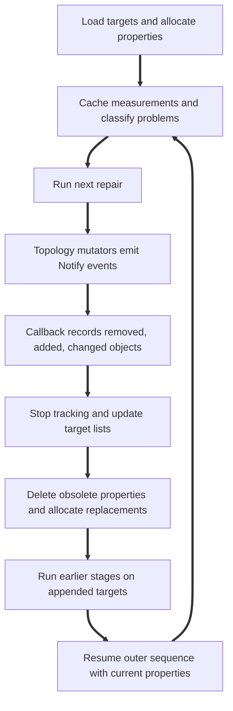

<!-- SPDX-FileCopyrightText: Copyright (c) 2026 NVIDIA CORPORATION & AFFILIATES. All rights reserved. -->
<!-- SPDX-License-Identifier: Apache-2.0 -->

# BRep Healer Design

This is an internal reference for agents changing or diagnosing the healer. It describes the
current callback-based implementation, including its limitations. Symbol names are source
anchors; recheck executable code when it disagrees with historical comments or this reference.
The skill entrypoint links the public operation guides.

## Contents

- [Execution model and entrypoints](#execution-model-and-entrypoints)
- [Stages and stop semantics](#stages-and-stop-semantics)
- [Incomplete and disabled repairs](#incomplete-and-disabled-repairs)
- [Properties, problems, and ownership](#properties-problems-and-ownership)
- [Notifications and invalidation](#notifications-and-invalidation)
- [Recursive refresh and iteration](#recursive-refresh-and-iteration)
- [Seams and loops](#seams-and-loops)
- [Debugging and validation](#debugging-and-validation)
- [Source map](#source-map)

## Execution Model and Entrypoints

The healer alternates **cache steps**, which measure topology/geometry and classify defects, with
**fix steps**, which attempt repairs using those measurements. A repair can remove, split, merge,
or edit objects. Its affected targets must reenter earlier stages before later stages consume
them. `SmHealData` owns the state for this process; it does not own the BRep being repaired.



The diagram shows a topology-changing repair. Some stages only update tolerances or cached
flags, and geometry-only tracking currently has a narrower effect described below.

| Entry | Behavior to verify |
|---|---|
| `_omni_solid.heal_brep` → `SmApiHealBrep` → `SmBrep::HealBrep` | Mutates the BRep; Python returns the same handle. The API requests `SM_HO_ALL` without per-stage control. |
| `SmBrep::HealBrep` | Creates a temporary `SmHealData`. Currently discards the nested status and returns `SM_SUCCESS`; it is not proof all repairs succeeded. |
| `SmHealData::HealBrep` | Resets the session, gathers/copies optional target arrays, calls `LoadTargets`, then returns `HealTgts`'s status. Retain this object to inspect caches and problem lists. |
| `SmHealData::LoadTargets` / `HealTgts` | Internal controls for explicit target sets and stage-level diagnosis. `LoadTargets` expects fresh/reset state. `HealTgts` runs from the beginning; it is not a resume API. |
| `SmBrep::MakeTopologyFromData` | Calls healing when enabled and the stored healer version is older than `SM_HEALER_VERSION`, or when `bAlwaysHeal` forces it. Enabled import healing is not unconditional execution. |

The USD path is `SmPyUsd.cpp` → `SmApiUsdImportBrep(s)` →
`SMU_BrepConvert::BrepMove_UsdToSMLib` → `BrepMove_OneUsdBrepToSMLib` →
`MakeTopologyFromData`. Current Python USD imports default to `heal=False`. `SmuConvert.cpp`
selects the current healer version only when `m_sCADSource` equals `"SMLib"`; otherwise it assigns
an older version. In the ordinary USD read path, `UsdBrepArrayData::ReSet` clears that string and
`UsdBrepRead.cpp` leaves its read commented out. The bridge also does not populate it on export.
Consequently, enabling USD import healing currently runs it even for SMLib-authored USD.
The source-selection branch is infrastructure awaiting provenance data, not an effective filter.

CAD provenance was intended as custom data, not a schema attribute, but its meaning (kernel or
authoring application) and healing policy remain unresolved. Do not invent a metadata key or
infer healing eligibility from an application name. SMB files carry healer-version information
used by their import gate; that does not establish equivalent provenance for USD. Check the actual
flag and version arguments. Direct `heal_brep` bypasses the import version gate.

Optional targets in `SmHealData::HealBrep` are copied. Despite the parameter comments, deletions
are not written back to the caller's arrays. Selected targets also do not provide an isolation
boundary: fixes can change connected topology.

`HealTgts` temporarily enables BRep editing and locks a context mark with `SmNewMarkAndLock`.
Healing mutates topology, geometry, caches, tolerances, and marks; it is not a read-only validator
or a transaction with rollback. 

## Stages and Stop Semantics

The order comes from `SmHealData::HealTgts` and `SmHealerOpType` in `SmHealProbArray.h`.
Use enum names rather than numeric debug labels: the labels and enum values are not identical.

| Order in the sequence | Current work and dependencies |
|---|---|
| `Cache_EdgeProps`, `Cache_VertexProps`, `Cache_FaceProps_Gaps` | Establish intervals, gap/tolerance measurements, degeneracy, and initial flags without completed seam/loop classification. |
| `Fix_TolSizes` | Adjust stored tolerances from measured gaps, in face → edge → vertex order. This is distinct from geometrically closing gaps. |
| `Cache_CoinVertices`, `Fix_CoinVertices` | Find coincident vertex pairs and combine them. |
| `Cache_DegenFaces`, `Fix_DegenFaces`, `Fix_DegenEdges` | Classify and remove/squeeze degenerate faces before edges; new topology needs earlier properties rebuilt. |
| `Cache_CoinEdges`, `Fix_CoinEdges`, `Cache_MissedEdgeXSects`, `Fix_MissedEdgeXSects` | Unfinished stages. Detection is TODO; fix helpers can return error if their problem arrays are populated directly. |
| `Fix_UncontainedEdges`, `Fix_BadGaps` | The former adjusts a cached edge interval/flag without applying an edge geometry repair; the latter is a no-op. Neither establishes general gap repair. |
| `Cache_FaceProps_Stage2` (`SM_HO_CACHE_FACEPROPS_2`) | Cache surface, periodicity, poles, and seam classifications for the next repairs. |
| `Fix_MoveSeam` | Try moving a periodic seam away from face boundaries, or improve its location when it must remain inside the face. |
| `Fix_SplitEdgesAtSeam` | Split boundary edges crossing seams; prerequisite for later loop analysis. |
| `Fix_BadSheets` | Repair sheet/region organization. |
| `Cache_FaceProps_Stage3` (`SM_HO_CACHE_FACEPROPS_3`) | Build loop properties, containment/orientation information, and missing-pole/loop problem lists. |
| `Fix_SplitFaceAtSeams` | Insert seam boundaries/split faces using classifications. |
| `Fix_BadLoops` | Has callable implementation, but its call in `HealTgts` is commented out. Ordinary `SM_HO_ALL` does not execute it. |
| `Make_UVTrimCurves` | Creates curves only when `bMakeUVTrimCurves` is true; default false, including the ordinary API call. |
| `Fix_InfiniteRegion` | Repair obvious infinite/void/solid region classifications; not a general region classifier. |

`Fix_BackPointers` is also disabled/unimplemented; its enum does not establish a working repair
for arbitrary broken links. The pipeline delays reliance on UV trim curves while topology and
seams are unsettled. Do not require them prematurely in a new early stage.

### A requested stage normally includes that stage

`HealTgts` resets `m_eDoneHealOp` to `SM_HO_NONE`. Each `SM_HEALSTEP_*` macro:

1. Checks whether the **previous completed stage** is less than requested `eHealerOp`.
2. Calls its cache/fix function.
3. Assigns that function's enum to `m_eDoneHealOp` after success.

For active stage enums this runs through the requested stage, inclusively. Because the predicate
checks the previous completed stage, a disabled requested stage can overshoot: requesting
`SM_HO_FIX_BADLOOPS` reaches `Make_UVTrimCurves`, not the commented-out fix. At the end of
`SM_HO_ALL`, `m_eDoneHealOp` is `SM_HO_FIX_INFINITE_REGIONS`.

### Refresh catches up to the last completed stage

`UpdateTargetLists` clamps its requested stage to the outer `m_eDoneHealOp`, saves outer state,
and calls `HealTgts` for appended targets. During a running fix, `m_eDoneHealOp` still names its
predecessor. For example:

```text
outer Fix_MoveSeam is running
  m_eDoneHealOp = SM_HO_CACHE_FACEPROPS_2
  UpdateTargetLists(changes, SM_HO_FIX_MOVESEAM)
    clamp to SM_HO_CACHE_FACEPROPS_2
    rebuild replaced properties through seam classification
  return to Fix_MoveSeam without recursively moving the same seam
```

This exclusion comes from the clamp and call context, not an exclusive-stop `HealTgts` contract.
A direct helper call after a different completed stage can behave differently. Inspect both the
requested stage and `m_eDoneHealOp`; do not mechanically lower every refresh request by one.

## Incomplete and Disabled Repairs

These functions have bodies, but their names and successful returns do not imply a working repair:

| Function | Implementation status and consequence |
|---|---|
| `Cache_CoinEdges` | Detection is unwritten; leaves `pbNewProbs` false and does not populate the coincident-edge problem list. |
| `Fix_CoinEdges` | Repair is unwritten; returns `SM_ERR` for a nonempty problem list and success otherwise. |
| `Cache_MissedEdgeXSects` | Detection is unwritten; leaves `pbNewProbs` false and does not populate the missed-intersection problem list. |
| `Fix_MissedEdgeXSects` | Repair is unwritten; returns `SM_ERR` for a nonempty problem list and success otherwise. |
| `Fix_BadGaps` | No-op returning success; does not edit geometry to close gaps. |
| `Fix_UncontainedEdges` | Placeholder clamps only the cached interval and clears its problem flag; it does not repair the underlying edge. |
| `Fix_BackPointers` | Disabled/unimplemented; cannot repair an arbitrary broken pointer graph. |
| `Fix_BadLoops` | Callable but disabled in `HealTgts` because classification and repair of broken loops remain unreliable. |

Keep the real TODO/STUB annotations for these incomplete functions. Keep `Fix_BadLoops` disabled: a successful
missing-pole helper test establishes that particular path, not the correctness of general broken-loop
classification or the safety of enabling the stage. `Fix_TolSizes` changes tolerances and is not a
substitute for the missing geometric gap repair.

## Properties, Problems, and Ownership

| State | Meaning and lifetime |
|---|---|
| `m_sTgtVertices/Edges/Faces` | Borrowed topology pointers. Refresh removes, compacts, and appends; old comments claiming constant size are stale. |
| Matching `m_sTgtVertexProps/EdgeProps/FaceProps` | Parallel arrays of owned heap objects. A topology pointer can survive while its property object is deleted and replaced. |
| `SmProbArray<T>` | Property pointers linked to a boolean problem member. Entries may remain after the flag is cleared, for reporting; membership alone does not mean an unresolved defect. |
| `SmPairProbArray<T>` | Problem pairs, such as coincident vertices. Specialized removal/reporting also handles fixed singleton survivors; do not manipulate the underlying array as a generic set. |
| `SmMixedProbArray<T>` | Linked multi-state property, such as a sheet that may be acceptable, problematic, or fixed. |
| `SmTriedProbArray<T>` | Linked attempt state: `NONE`, `RAN`, `FIXED`, or `NOFIX`. `Add` writes the linked member. A completed call alone does not justify `FIXED`. |
| `m_sNotYetFaceProps` | Owns properties transferred out of active targets because their problem is unsupported. This preserves diagnostics; it is not a successful repair. |
| `m_sNew*` result arrays | Record topology produced by particular fixes; do not replace target maintenance or confer topology ownership. |

Ordinary problem/attempt arrays borrow properties. `FreeTargets` deletes owned properties during
destruction/reset. `MoveToNotYetProblems` transfers ownership; `Remove*Props_FromLists` only
unlinks a property. `UpdateTargetLists` uses those unlink helpers and then deletes properties for
removed targets. Fix functions must not independently delete them. `SmHealData` is noncopyable.

`SmProbArray::Add` ordinarily sets the linked flag; `Remove` only unlinks, without clearing the
flag. Adding a new problem requires wiring `SetupEmptyProbArrays`, reset/removal helpers, and
diagnostics as well as declaring the array. Keep linked flags, attempt results, and lists consistent.

### Property stages are dependency assumptions

Vertex properties hold vertex-edge/face gaps and tolerance state. Edge properties hold borrowed
curve/edge pointers, natural/trimmed intervals, approximate length, gaps, and degeneracy.
`SmFaceProps::SetProps` builds missing prerequisites before the requested stage:

- **Gaps:** face identity and gap/tolerance state.
- **Stage 2:** borrowed `m_cpSurface`, natural domain, closure, poles/flat corners, owned seam
  classifications (`m_pCrvClassU/V`), and missing/crossed/near-miss seam flags.
- **Stage 3:** owned loop tree/properties, orientation/containment, missing poles, and loop defects.

`HasProps` checks stage/face identity, not versions of all surface, edge, or loop dependencies.
A live property may contain stale topology pointers inside a classification after an adjacent
edge is deleted. `Fix_SplitEdgesAtSeam` explicitly checks for this with
`HasDeadTopologyPointObject`.

`SmFaceProps::ReSet(stage)` clears that stage and later stages, deleting owned classifications
or loop trees as appropriate. Even a Stage 3 reset clears attempt-state members. Saved nested
pointers and attempt bookkeeping can become invalid without replacing the property itself.
Resetting fields alone does not rebuild all `SmHealData` problem/attempt collections.

Record actual gap and tolerance sources when diagnosing classification. `Fix_TolSizes` estimates
model scale, updates BRep tolerances, then faces → edges → vertices; connected higher-level
tolerances and measured gaps contribute to lower-level tolerances. It can shrink or grow them.
Preserve original/effective tolerance distinctions. A tolerance adjustment does not establish
geometric coincidence, and loosening it cannot repair stale classifications.

## Notifications and Invalidation

`SmObject::Notify` dispatches to user and system callbacks on the object's context.
`SmTrackTopologyChanges` manages the system slot; the callback class is named
`SmTopologyChangeCallback`. Its `Execute` builds unique removed, added, and changed lists.
Only faces, edges, and vertices become tracked targets.

The callback is context-wide, not filtered by the BRep supplied to the tracker constructor.
Scope a tracking interval to the intended mutation. Nested/overlapping system trackers on the
same context are unsupported. `StartTracking` clears prior lists; it is not a resume.

| Notification (without `SM_NO_` prefix) | Relevant payload and effect |
|---|---|
| `ADD_TO_BREP` | `pData1` is added topology → add list. |
| `RM_FROM_BREP` | `pData1` is removed topology → remove list; discard it from add/change lists. |
| `SPLIT_IN_BREP` | `pData1` original, `pData2/3` children → remove original, add non-null children; a child may reuse the original pointer. |
| `MERGE_IN_BREP` | `pData1` survives, `pData2` consumed → remove both old property identities, add survivor. |
| `TRIM_NO_SPLIT_IN_BREP` | `pData1` survives but changed → remove and add it for property rebuilding. |
| Topology `POST_EDIT` | Caller `pObj` is completed face/edge/vertex edit → remove and add the same target. |
| `CHANGE_GEOMETRY` | Caller `pObj` is topology; `pData1` is new geometry, not the target → change list. |
| Geometry `POST_EDIT` | Resolve caller's owning topology → change list. |
| Geometry `SPLIT` / `MERGE` | Resolve owner in `pData3` → change list. |
| `DESTRUCTION` | Discard dying topology from add/change lists. Does not itself add it to remove list. |

Read the emitting call when interpreting a payload; the `SmObject*` slots are not interchangeable.
Geometry owners can nest curves and surfaces in either order; UV curves reach edges through
edgeuses. Walk the current owner instead of repeatedly reading the original object's owner.
A forwarded topology edgeuse `POST_EDIT` is not a geometry-owner event. `REG_PROPAGATION`
carries opaque region-array payloads and is ignored before object inspection.

**Current limitation:** `UpdateTargetLists(tracker, stage)` consumes only remove/add lists.
Geometry-only `ChgList` entries record changes but do not trigger property rebuilding. For a
completed topology mutation requiring new properties, emit the correct topology event in its
owning mutator. Do not mislabel a geometry payload as topology or manually patch a fix's tracker
lists. Extending geometry-only invalidation needs an explicit dependency policy and consumer tests.

`AddUnique`, `Remove`, and callback reset helpers keep debug index arrays aligned with topology
lists. Direct list mutation bypasses this invariant and can crash debug `StopTracking`/`Dump`.
Indices are event-time diagnostics, sometimes a sentinel when no BRep is supplied, not stable
IDs. Historical event pointers can refer to deleted objects; do not recover diagnostic indices
later by dereferencing them.

## Recursive Refresh and Iteration

The normal sequence for a topology-changing fix is:

```cpp
SmTrackTopologyChanges changes(pBrep, TRUE);
// Perform the batch through topology mutators that emit Notify events.
changes.StopTracking();
SER(UpdateTargetLists(changes, currentOperation));
// Reacquire properties before reading or recording the result.
```

`UpdateTargetLists` rejects an actively tracking argument. It then:

1. Finds removed target properties by pointer identity, unlinks all their list references, and
   deletes them. Removal-list topology may already be freed; do not dereference it.
2. Filters null/stale additions with `IsLiveTopologyMember`, classifies surviving targets by type,
   and appends them with fresh property objects.
3. Uses temporary `m_lOldFaceCnt/EdgeCnt/VertexCnt` offsets to restrict earlier cache work to
   appended targets, saving/restoring stage state during recursive `HealTgts`.

The same topology address in both lists is intentional: replace its cached properties, including
for an edit preserving the face address. It can also arise from splitting or allocator reuse.
Do not cancel those entries as a no-op. Refresh deletes properties, not the topology itself.

Some repair loops use global problem lists during catch-up, so appended-target offsets do not
isolate the entire nested sequence from existing targets. A snapshot protects container iteration
from compaction but does not keep its pointed-to properties alive. Recheck queued pointers
against current target properties before dereferencing after refresh.

Choose tracking/refresh intervals from mutation dependencies. `Fix_CoinVertices` deliberately
uses per-pair tracking and rechecks its snapshot. Its source comments document a
`SmObjsInVoxels::Remove` cleanup bug: batching multiple vertex removals into one refresh can
corrupt voxel storage. Preserve that per-pair boundary. Loop/pole batches defer refresh until
traversal finishes. Stopping in only the first iteration loses subsequent events. Leaving an outer
tracker active during recursive refresh conflicts with the context's single system slot.

Current gap: `UpdateTargetLists` ignores the recursive `HealTgts` return. Check rebuilt state and
diagnostics; its own `SM_SUCCESS` alone does not establish successful catch-up.

## Seams and Loops

`SmFace::HasSeamProblem` produces separate **crossed**, **missing**, and **near-miss** seam
classifications in U/V. `Fix_MoveSeam` consumes Stage 2 results, tries `SmFace::MoveSeam`, and
refreshes affected face properties before `Fix_SplitEdgesAtSeam`. Refresh must reach Stage 2:
new properties with only gap measurements have no usable surface/seam cache.

`Fix_MoveSeam` marks attempted faces with a locked mark, refreshes, then records `FIXED`/`NOFIX`
on current properties according to rebuilt flags. Results written to old properties before refresh
would be lost on deletion. Nested healing obtains another locked mark, preserving outer selection.

### Periodic extents: equal endpoints are ambiguous

`SmPeriodicExtent1d(period)` starts full-period. `SetMinMax(u, u)` also means full-period by
default; a single point requires `SetMinMax(u, u, NULL, TRUE)`. `MoveSeam` must start boundary
coverage as a single point, including its first sampled UV point, so the loop conditioned on
`!IsFullPeriod()` can accumulate coverage. Otherwise ordinary crossed seams can silently skip
movement; the near-miss full-period branch can still run. This geometry/control-flow issue is
independent of whether the callback correctly refreshes the face.

### Topology notification boundaries

Useful emitting mutators include `SmBrep::ReplaceSurface`, face/loop orientation changes,
`SmFace::InsertLoop`/`RemoveLoop`, `SmBrep::MakeFaceFromLoopOnFace`, and `MakeVertexLoop`.
Their notifications let seam/loop repairs rebuild properties without manual list edits. Notify
after the affected operation is complete, when observers can rely on its advertised state.

`SmFace::SetSurface` emits `CHANGE_GEOMETRY` before assigning the new surface.
`SmBrep::ReplaceSurface` supplies the completed face `POST_EDIT` after replacement. Prefer
that existing operation when its contract fits; defer property rebuilding to the completed edit
boundary rather than attempting it inside the early geometry notification.

An unattached loop is a legitimate intermediate state during a move between faces. Its orientation
flip must tolerate a null faceuse and notify a face only when attached; `SmLoop::GetFace` itself
requires attachment. Destination insertion supplies its completed face edit notification.

`Fix_BadLoops` handles missing pole vertex loops, extra/nested loops, ordering, and orientation,
but is disabled in the main sequence. Its missing-pole regression invokes it directly on multiple
faces to catch tracking that stops after the first face. Test helper behavior and reachability
separately.

## Debugging and Validation

Locate the earliest incorrect boundary: selection → measurement → classification → mutation →
event → refresh → next consumer. Inspect `m_eDoneHealOp`, `m_eStopHealOp`, recursion depth,
old-target offsets, property stage, live owning surface/topology, and linked problem/attempt states.

- `SmDebugThisFaceIndex/EdgeIndex/VertexIndex`, `Dump`, and `DumpArraysContaining` help follow
  targets. Indices can shift on refresh; reacquire from live state.
- `SM_TOPOCHANGE_NOTIFY` with `SM_DEBUG_CODE` enables event/StopTracking diagnostics.
  Compare topology-list and index-array sizes after additions, removals, resets, and restart.
- `bReportStepProgress` and `bReportErrorFinds` are source-local debug switches, not API options.
  Broad `bDebugMe` blocks can enter graphics loops; avoid enabling them headlessly.
- Nonempty problem lists can include repaired history; inspect flags. `SM_SUCCESS` can come
  from a stub or ignored status. `Make_UVTrimCurves` warns on individual creation failures but
  returns success. The sequence has no mandatory final `AssertValid` or residual-error aggregation.
- Bisect with fresh BRep copies and fresh `SmHealData` sessions, one stop stage per run.
  Repeated `HealTgts` on populated state reruns cache/list construction and can duplicate entries.
- Validate completed topology separately using the BRep model reference. Healing cannot safely
  traverse every arbitrarily damaged pointer graph and does not establish validator completeness.

Existing `smTopoTest.cpp` regressions named in `SKILL.md` cover actual seam movement plus
refresh, geometry owner chains, detached loops, reset/deletion, and multiple missing-pole faces.
For a new defect, assert the repaired state and the next consumer's required caches, not only
that an event appeared. Compare debug logs as well as exit status; use test-selection guidance
for focused and broader suites.

## Source Map

Paths are repository-relative. Search these symbols before expanding scope.

| Concern | Source anchors |
|---|---|
| Stable entrypoints | `source/SmPyLib/src/SmPyHeal.cpp`; `source/SM_API/src/SmApiHeal.cpp` |
| Import gate | `source/SmPyLib/src/SmPyUsd.cpp`; `source/SM_API_USD/src/SmApiUsd.cpp`; `source/BREP_SM_USD/src/SmuConvert.cpp`; `source/SMLib/src/SmBrep.cpp`: `MakeTopologyFromData`, `HealBrep` |
| State and execution | `source/SMLib/inc/SmHealData.h`; `source/SMLib/src/SmHealData.cpp`: `HealBrep`, `LoadTargets`, `HealTgts`, `UpdateTargetLists`, `FreeTargets`, `Remove*Props_FromLists` |
| Ordered operations and linked lists | `source/SMLib/inc/SmHealProbArray.h`: `SmHealerOpType`, `SmProbArray`, `SmPairProbArray`, `SmMixedProbArray`, `SmTriedProbArray` |
| Measured properties | `source/SMLib/inc/SmFaceProps.h`, `SmEdgeProps.h`, `SmVertexProps.h`, `SmLoopProps.h` and matching `.cpp` files under `source/SMLib/src/` |
| Events and tracker | `source/SMLib/inc/SmContext.h`; `source/SMLib/src/SmObject.cpp`: `Notify`; `source/SMLib/inc/SmTrackTopologyChanges.h` and matching `.cpp`: `Execute`, `StartTracking`, `StopTracking` |
| Seam geometry and loop edits | `source/SMLib/src/SmFace.cpp`: `HasSeamProblem`, `MoveSeam`; `SmBrep.cpp`: `ReplaceSurface`; `SmLoop.cpp`: `FlipLoopOrientation`; `SmPeriodicExtent1d.cpp`: `SetMinMax` |
| Owner traversal | `source/SMLib/src/SmCurve.cpp`: `GetEdge`; `SmSurface.cpp`: `GetFace`; `SmTrackTopologyChanges.cpp`: `Execute` |
| Regression examples | `tests/prog_test/src/smTopoTest.cpp` |
